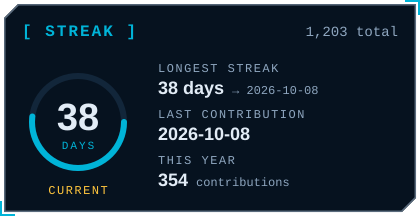
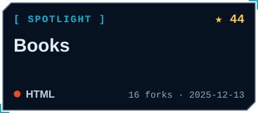
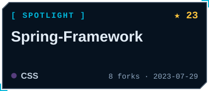
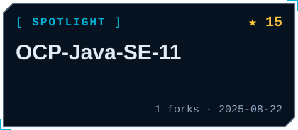
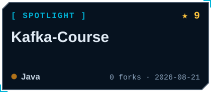
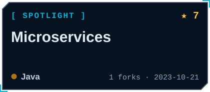
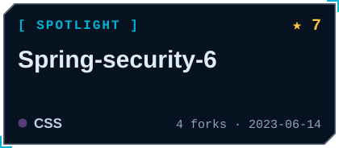

  
  
  
  

 

👋 Hey, I'm <b><a href="https://www.facebook.com/1995mars/">Mars</a></b>  
✨ <b>Fullstack Web Developer</b> with deep roots in <b>Java</b>, building secure and scalable web applications from design to deployment. 
☕ Spring Boot · Security · Hibernate   
🔌 REST APIs · Microservices · Kafka   
🗄️ MySQL · Oracle · PostgreSQL · MongoDB  
→ always levelling up

  

  

  

  
  

  

  
  
  
  
  
  

  

  
  
  
  
  
  

  

  

  

  

 

  
   

