


  
  
  
  

👋 Hey, I'm <b><a href="https://www.facebook.com/1995mars/">Mars</a></b>  
✨ <b>Fullstack Web Developer</b>  
✨ with deep roots in <b>Java</b>, building secure and scalable web applications from design to deployment. 
☕ Spring Boot · Security · Hibernate &nbsp;|&nbsp; 🔌 REST APIs · Microservices · Kafka &nbsp;|&nbsp; 🗄️ MySQL · Oracle · PostgreSQL · MongoDB &nbsp;|&nbsp; 🚀 always levelling up

  


  

  


  
  
  
  
  
  

  <a href="https://github.com/1995mars/Books"></a>
  <a href="https://github.com/1995mars/Spring-Framework"></a>
  <a href="https://github.com/1995mars/OCP-Java-SE-11"></a>
  <a href="https://github.com/1995mars/Kafka-Course"></a>

  

<b>🏆 Achievements</b>

  

  
   
  <b>☕ Buy me a coffee</b>

  
   
  Status widgets by <a href="https://github.com/billtruong003/git-profile-awaken">git-profile-awaken</a>

